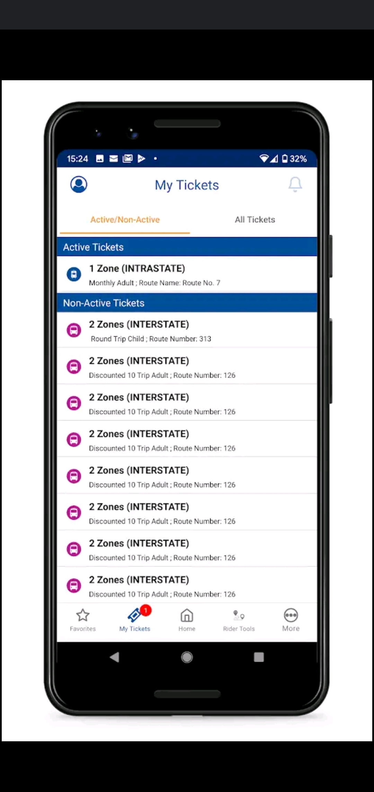

# 2021AppDevelopmentProject
 
<h2>APPLICATION PROPOSAL: <h3>NYFTATix (NEW YORK FAKE TRANSIT ASSOCIATION TICKET)</h3></h2>

 
   Our app will be designed to allow any individual to buy and use a bus or subway fare from their phone! Strangely enough, there is no app implemented for New York city, despite there being one for New Jersey (which allows users to travel both locally in the state, and to and from New York City and Pennsylvania). This application will make buying a metro card obsolete and help any rider in a hurry to catch a bus in a pinch. As noted above, there are already several applications—for example  The Metro North Tix application and the New Jersey Ticket application—similar to NYFTATix that will serve as great examples to help create this application. 

 

Persona 1:
 
Details: 
   Marie is a young high school student who buys her metro card form the school and usually asks for the exact amount to get her home. However, Marie was not paying attention one day and missed her stop. This normally would not be a problem but the spacing for this stop was unusually large since it passed a cemetery. Realizing her mistake, Marie got off on the next stop but had no way to catch another bus as her metro card was empty even though she had a credit card and cash on her. She would be unable to use her credit card on the bus as the bus only accepts cash. And considering that buses only accept exact cash since the bus drivers do not carry cash on them, she was unable to use the money she had on her.

    
Goals:
 
   Marie would have appreciated it if there had been an app like NYFTATix so that she could purchase a ticket from her phone and not have to worry about walking back through the cemetery. 
 4. Map Tracking of bus schedule  
 5. Color and Bar code that changes daily  
 6. Bus and Train Routes  
  
 
Market Comparison:  
  This application is not completely unique as there are a few applications out there that are similarly to it; but what makes it unique is that there is no application set up for the NY public transit system at this time. The applications we are basing this on are the MTAeTix and the NJ TRANSIT Mobile App. The MTAeTix application is a ticket app for the Metro North, which allows a user to purchase a ticket (single ride, weekly, monthly). Once the pass is activated, a new QR code and band of color with date and time appear at the top of the ticket, which allows the ticket master to view and approve. The NJ TRANSIT Mobile application works similarly to MTAeTix but this application  also allows users to purchase tickets for all public NJ transit  (buses and rail lines alike), giving riders multiple ways to reach their destination. We would like to implement these features into our application as well, in order to not only have it replace the flimsy metro card that everyday commuters use, but also help those riders who don’t travel by bus or subway often. This will help commuters save money in the long run, as there is no need to spend one dollar to get a new metro card whenever they miraculous stop working with money still on it, get lost with money still on it, or become expired. 

 
 
  <h4>Images NJ Transit Mobile App:</h4>  
   
  
  
  
   
   
  <h4>Images NY MTAeTix App:</h4>  
   
  
  

 
Technologies:  
 Android Studio  
 Google MAPs API  
 Firebase  
 QR CODE Package 
 
 Video Demo Link:https://www.youtube.com/watch?v=rSCeq2HMVrI&t=2s
  

 
<h3>Current Status of Project</h3>
 
April 7, 2021:
So far, we have created a prototype of our application. We currently have a draft of our application up. This draft includes the layouts and activities of a ticket page, a map page, and a profile page. We have included the Google Maps API to the application. 
 

 
April 9, 2021:
We added firebase database to our project. We also are currently able to find a user's location using Google maps API. 

April 14, 2021:

Testing of the Login and Sign up Requirments

April 19, 2021:

PolyLines added to Google Maps. Users are able to search for a location. 

Added Login and signup authentication. Login checks for registered users. Signup allows users to enter valid email (not used prior) and password. 

April 28, 2021:

Confirmation password added, Information of profile saving, working on ticket saving feature

May 1, 2021:
Presetnation and Video uploaded

